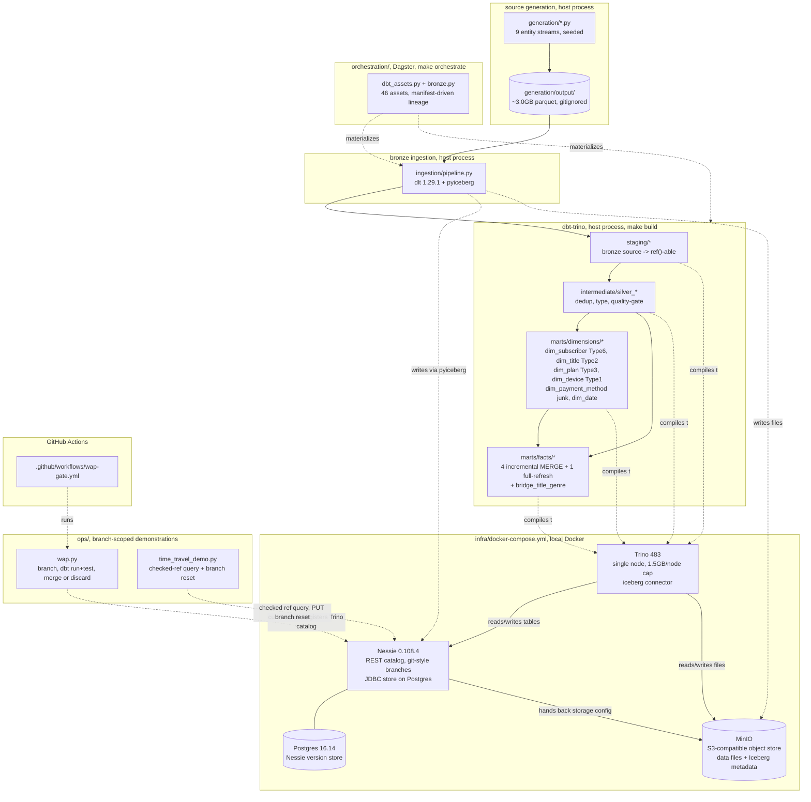

# Architecture

The README describes this lakehouse at a pitch level; this document goes deeper. It covers layer
boundaries and what enforces them, the real data flow from generation to gold, the stack and why
each piece was chosen, a full system diagram, and two real incidents that tested this pipeline
under actual failure rather than only in design review.

## Layer boundaries

Bronze, silver, and gold are Nessie namespaces backing physically separate Iceberg tables, not a
naming convention layered over one schema.

**Bronze** (`bronze.bronze_<entity>`, nine tables) is raw and append-only. Source schema verbatim,
plus four ingestion metadata columns on every row: `_source_file`, `_ingested_at`, `_batch_id`,
`_payload_hash`. Never modified after write, fully replayable from the same source Parquet.
`ingestion/pipeline.py` is the only writer.

**Silver** (`silver_<source>` under `intermediate/`, staging models one layer up as `stg_<source>`)
is cleaned, conformed, deduplicated, typed, and quality-gated. One row per real-world entity event.
Business keys resolved. dbt models here read only from `staging/`, and `staging/` is the only layer
permitted to read a `source('bronze', ...)` directly.

**Gold** (`marts/dimensions/`, `marts/facts/`) is the dimensional model: six dimensions, five
facts, one bridge table. Gold models read only from silver.

The rule that makes this a boundary and not a convention: a gold model reading bronze directly is
an architecture violation. That rule held on review discipline alone for most of the build, until a
red-team interview simulation asked the obvious follow-up, how do you actually know, and the honest
answer at the time was "someone would have checked at review time," which is not a proof.
[`tests/unit/test_medallion_boundary.py`](tests/unit/test_medallion_boundary.py) closes that gap
mechanically: it parses the static dbt manifest
(`transform/lakehouse/target/manifest.json`) and asserts that no model under `intermediate/` or
`marts/` has a direct dependency edge on a bronze source. A companion assertion
(`test_manifest_has_bronze_sources_and_medallion_layers`) checks the manifest actually contains all
nine bronze sources and all three layers, so the real test cannot pass silently over a stale or
empty manifest. It runs as part of `make test`. Verified clean across all 68 models in the project
at the time the test was added.

## Data flow, generation through gold

**Generation** (`generation/`). Nine entity streams, one module each (`reference.py` for plans,
devices, and title_genres; `subscribers.py` and `titles.py` for the two change-event dimension
feeds; `playback.py`, `billing.py`, `watchlist.py`, `signup_funnel.py` for the fact-shaped streams).
`config.py` holds a single project-wide `SEED`; `rng.py`'s `child_rng(seed, label)` derives an
independent generator per labeled stream, so any one stage can be rerun in isolation without
perturbing another. `generate.py` is the CLI entry point, writing Parquet under
`generation/output/<entity>/`. Full scale: about 104 seconds, roughly 3.0GB on disk,
120,000,300 playback rows, 1,515,049 billing rows, 750,000 watchlist rows, 70,701 signup-funnel
rows, 199,928 subscriber-change events, 15,098 title-change events. Eleven pathologies are injected
deliberately at known rates (late-arriving dimension members, late-arriving facts against a
historical dimension version, duplicate business keys, out-of-order arrival, null join keys,
same-day multi-attribute changes, mid-stream schema drift, mixed soft/hard deletes, malformed rows),
each with a CSV or JSON manifest under `generation/output/_pathology_manifest/` and asserted present
by `generation/sanity_check.py` at both scales. Full detail: [`docs/02-data.md`](docs/02-data.md).

**Bronze ingestion** (`ingestion/pipeline.py`, run as `uv run python -m ingestion.pipeline`, called
by `make seed`). dlt 1.29.1, `pyiceberg` under the hood via a `filesystem` destination with
`table_format="iceberg"` (there is no dedicated dlt Iceberg destination package). One dlt resource
per entity (`ingestion/sources.py`), reading Parquet through DuckDB, attaching the four metadata
columns, appending into `iceberg.bronze.bronze_<entity>`. Replay-safety unit is the file, not the
row: `dlt.current.resource_state()` tracks which relative file paths have already loaded and skips
them, and that state is written into the destination itself
(`s3://warehouse/bronze/_dlt_pipeline_state/...`), not only cached locally, so a fresh clone against
an already-populated warehouse still skips correctly. Production run of the full dataset (~123M rows
across 9 tables): about 3 minutes 50 seconds, 5.1 GiB landed in MinIO. Re-running afterward loads
zero new packages, the idempotency proof at production scale.

**Silver build** (`transform/lakehouse/models/staging/`, `.../intermediate/`, dbt-trino, `make
build`). Staging models expose bronze as `ref()`-able relations; intermediate models
(`silver_<source>`) deduplicate on the business key where bronze carries real duplication
(`silver_billing_ledger`: 1,515,049 rows to 1,500,100 distinct ids; `silver_signup_funnel`: 70,701
to 70,000) and route malformed playback rows to `silver_playback_sessions_rejected` via three
narrow rejection models rather than a derived `CASE` column, which matters at 120M-row scale (see
Trino memory constraints below).

**Gold build** (`transform/lakehouse/models/marts/`, same dbt-trino invocation). Dimensions build
first: `dim_subscriber.sql` (Type 6, the most mechanically involved model in the project: status
remapping, three running-counter window functions for version/plan/status segments, a plan-segment
cursor for `previous_plan_tier`, a status-segment cursor for `churn_date_key`, and a late-arriving
self-heal step), `dim_title.sql` (plain Type 2), `dim_plan.sql` (Type 3), `dim_device.sql` (Type 1),
`dim_payment_method.sql` (junk dimension, full cross product of observed domains), `dim_date.sql`
(`dbt_utils.date_spine`) plus its three role-playing views. Facts follow: `fct_playback_events.sql`,
`fct_billing_transactions.sql`, `fct_daily_subscription_snapshot.sql`, `fct_watchlist_adds.sql`
(all four incremental Iceberg MERGE), `fct_signup_funnel.sql` (full-refresh, deliberately, see
below), `bridge_title_genre.sql`.

**Orchestration** (`orchestration/`, Dagster, `make orchestrate`). `assets/dbt_assets.py` wraps the
whole dbt project via `dagster_dbt`'s `@dbt_assets`, reading asset keys, dependencies, and column
schemas straight from the dbt manifest, selection scoped to `resource_type:model,package:lakehouse`
to exclude the elementary package's own bookkeeping models. `assets/bronze.py` supplies the one
asset dagster-dbt does not generate, a `@multi_asset` wrapping `ingestion/pipeline.py`'s real
`run()` directly, with asset keys chosen to match what dagster-dbt already computes for each dbt
source so upstream dependencies resolve with no manual key mapping. The generator itself is
deliberately not wrapped as a Dagster asset: it is the one-time, seed-driven step that produced the
fixed dataset every model and every number in this project assumes, and making it re-runnable
upstream of bronze would invite silently regenerating that dataset out from under everything built
against it. Verified asset graph: 46 assets, 37 dbt models plus 9 bronze sources.

## The stack, and why each piece

| piece | choice | why (brief) |
|---|---|---|
| catalog | Nessie 0.108.4, JDBC store on Postgres | Only one of Nessie/Polaris/Lakekeeper with catalog-wide, multi-table git-style branching, the mechanism write-audit-publish needs. [ADR-001](docs/decisions/ADR-001-catalog-choice-nessie-over-polaris-and-lakekeeper.md) |
| table format | Iceberg v2 | v3 (deletion vectors, row lineage) shipped in core Iceberg 1.11 but Trino and PyIceberg don't fully support it yet; v2 is the version every engine in this stack agrees on. [ADR-002](docs/decisions/ADR-002-iceberg-table-spec-v2-over-v3.md) |
| object store | MinIO, S3-compatible | Local, zero-cost, matches the S3 API every other piece already speaks. |
| query engine | Trino 483, single node, 1.5GB/node memory cap | dbt-trino's compile target and the read path for everything downstream; the memory cap is a deliberate, real constraint this project builds around rather than hides from (see below). |
| ingestion | dlt 1.29.1 (pyiceberg extra) | `table_format="iceberg"` on dlt's `filesystem` destination; no dedicated dlt Iceberg destination package exists. |
| transforms | dbt-core 1.10.22, dbt-trino 1.10.3 | Version pinned to what the adapters actually ship for, not dbt-core's own latest; dbt-trino has no release past the 1.10 line at pin time. |
| orchestration | Dagster 1.13.16 + dagster-dbt | Asset-based, manifest-driven lineage rather than a hand-built DAG. |
| deployment | local Docker only, no cloud path | Every free-tier cloud option carries real auto-billing risk with no hard $0 guarantee; staying local satisfies "never provision a paid resource" literally. [ADR-003](docs/decisions/ADR-003-local-only-deployment-no-cloud-path.md) |
| incremental watermark | bronze `_ingested_at`, not event time | An event-time watermark would silently and permanently drop the dataset's deliberately injected out-of-order arrivals. [ADR-004](docs/decisions/ADR-004-ingestion-time-watermark-for-incremental-processing.md) |
| surrogate keys | deterministic md5 via `dbt_utils.generate_surrogate_key` | Trino over Iceberg has no sequence object; a hash is a pure function of the data, so incremental, full rebuild, and backfill all produce the same key. [ADR-007](docs/decisions/ADR-007-deterministic-hash-surrogate-keys.md) |
| time travel | Nessie-native checked references, not Iceberg snapshot chaining | Nessie's REST bridge only exposes the current commit's snapshot per table by design; the working mechanism is a `<branch>@<hash>` reference passed to the catalog URL. [ADR-008](docs/decisions/ADR-008-nessie-native-time-travel-and-rollback.md) |

Full reasoning for each of these, including the runners-up and what was given up, lives in the
linked ADRs and in [`docs/06-tradeoffs.md`](docs/06-tradeoffs.md).

## System diagram

## Two incidents

Both are real, both happened during this build, and both are here because a system that has only
ever been designed to look resilient is a different claim than one that has actually failed and
recovered.

### The title catalog timing bug

`dim_title`'s design assumes titles arrive from a controlled catalog feed ahead of playback, which
is why, unlike `dim_subscriber`, it has no late-arriving self-heal path: an unseen title is supposed
to be a rare edge case that falls back to the unknown member. The original `generate_titles()` drew
each title's `catalog_add_at` from the same `[platform_launch, now)` span that
`generate_playback_events()` drew session timestamps from, with the title sampled for any given
playback row completely independent of that title's own catalog date. Subscriber signups and
playback sessions are front-loaded near `platform_launch`; titles were sampled uniformly across the
whole span. Result: 4,833 of 5,000 titles had at least one playback session timestamped before their
own first catalog entry, and `fct_playback_events` resolved `title_sk` to the unknown member on
20,646,958 of 119,640,099 rows, 17.3% of the entire fact.

The finding was made correctly the first time, during a review of `fct_playback_events`, and then
shipped anyway, logged as "flagged, built as specified" in `open-questions.md` rather than treated
as a defect. That is the actual failure worth naming: root-causing a bug is a diagnosis, not a
repair, and a working log entry is not a substitute for fixing the source when the source is what is
broken. It was caught for real on a later pass, not the original build.

The fix touched the generator, not the dimension: `generation/config.py` gained
`CATALOG_SEED_LEAD_TIME` (180 days) and `CATALOG_SEED_BUFFER` (1 day), and `generate_titles()` now
draws each title's first `catalog_add_at` from a window ending strictly before `platform_launch`,
always earlier than the earliest instant playback or watchlist can produce a timestamp, so the
ordering holds by construction rather than by chance. Verified to zero, not just improved: the full
dataset was regenerated with the same seed (103.5 seconds, every row count identical to the prior
run, confirming determinism held), all eleven pathology checks in `sanity_check.py` still passed,
and a direct row-level query confirmed 0 of 120,000,300 playback rows violate their title's
`catalog_add_at`. After a forced reload of `bronze_title_events` and a full-refresh rebuild of the
affected staging, silver, dimension, and fact models, `title_sk` resolved to the unknown member on 0
of 119,640,099 rows, down from 20,646,958. Full account:
[`docs/02-data.md`](docs/02-data.md#the-title-catalog_add-timing-bug),
[`docs/08-interview-notes.md`](docs/08-interview-notes.md#9-whats-the-most-embarrassing-bug-you-shipped-and-caught-and-how-did-you-catch-it).

### The WAP CI volume wipe

While locally dry-running the write-audit-publish GitHub Actions workflow with `act`, the real
local dev stack's data was destroyed. Root cause: `act` mounts the host Docker daemon by default
rather than an isolated one, and `infra/docker-compose.yml` hardcodes `name: iceberg-lakehouse` at
the top of the file. The CI workflow's own teardown step, `docker compose ... down -v`, is correct
and necessary on a real, isolated GitHub-hosted runner, but run locally via `act` it tore down the
exact same containers and volumes the already-running local stack was using. `docker volume ls`
afterward showed both the Postgres and MinIO volumes gone entirely: Nessie's whole commit history
and every table in MinIO, bronze, silver, dimensions, facts, all erased.

Recovery, in order: `make up` against fresh, empty volumes; a direct rerun of
`ingestion/pipeline.py`, exercising bronze's own replayability guarantee for real rather than in a
smoke test, since `generation/output/` lives on disk, not inside any Docker volume, and survived the
wipe untouched; then a full `dbt build --target trino` to rebuild silver and gold from bronze. The
rebuild hit two secondary problems worth expecting under similar conditions, a `CLUSTER_OUT_OF_MEMORY`
on the two heaviest quality-gated playback models (the known 1.5GB-per-query sensitivity, plausibly
aggravated by a second concurrent `act` attempt) and a `RemoteDisconnected` on `fct_playback_events`
plus two snapshot uniqueness tests at the exact moment a third `act` attempt tried and failed to bind
an already-used host port. Both were fixed by rerunning just the affected models with a clean Trino
container, then a full `dbt build` was re-run afterward as a no-op-expected final check that nothing
else was quietly broken.

The actual fix: `.github/workflows/wap-gate.yml` sets `COMPOSE_PROJECT_NAME:
wap-ci-${{ github.run_id }}` at the workflow level, overriding the fixed project name for CI's own
containers and volumes. Verified this actually prevents the collision, not just reasoned about: a
subsequent local `act` run against the fixed workflow failed fast and safely on a host port conflict
rather than attaching to or tearing down anything real. On a genuinely isolated GitHub-hosted runner
this override was never strictly necessary for CI correctness, only for the safety of testing CI
locally on a machine that also runs the real stack, which is exactly the gap that caused the
incident. Full account:
[`docs/07-operations.md`](docs/07-operations.md#incident-1-the-wap-ci-test-wiped-the-local-warehouse).

## The Trino memory ceiling, as a design constraint

`query.max-memory-per-node=1.5GB` (`infra/trino/etc/config.properties`) shapes real modeling
decisions in this project, not just query tuning. A bare full-width scan of `bronze_playback_sessions`
(~120M rows) costs approximately 1.47-1.50GB, right at the ceiling. Consequences that show up
directly in the model code: the malformed-row filter in
`transform/lakehouse/macros/playback_malformed_predicate.sql` is three inlined column comparisons,
not a derived `CASE` column, because a derived predicate defeats Trino's pushdown to the Iceberg
connector; the three malformed-row rejection branches are separately materialized small tables
rather than one `UNION ALL` over three scans of the wide source; there is no dbt-native `unique`
test on `playback_session_id` at this scale, verified manually instead (a 44-way monthly-chunked
scan, zero duplicates across all 119,640,099 rows) because the equivalent test query crashes the
Trino coordinator outright; and `fct_playback_events`' incremental watermark reads Iceberg's own
`$snapshots` system table rather than joining back to silver the way the two smaller incremental
facts do, because that join is itself a full self-join at a scale this node cannot safely run.
None of this is exotic engine tuning; it is the direct, traceable consequence of running a real
120-million-row fact table on a single memory-capped node, documented in full in
[`docs/07-operations.md`](docs/07-operations.md#the-trino-single-node-memory-ceiling).
