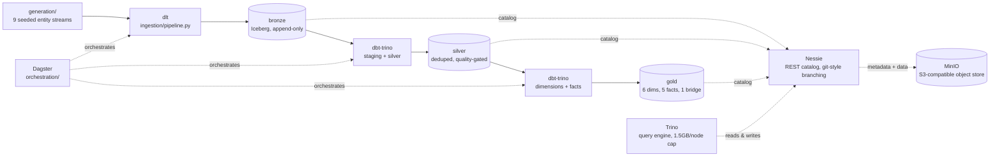

# iceberg-lakehouse-platform

A governed Iceberg lakehouse for a subscription streaming business: a real dimensional model, a
write-audit-publish gate that blocks bad data before it reaches production tables, and a synthetic
dataset with eleven deliberately injected data quality problems, built to prove the pipeline
actually catches them rather than to look good in a demo.

Local only. No cloud account, no cloud bill: Nessie, MinIO, Postgres, and Trino, all in Docker.

## The model

Six conformed dimensions, five facts, one bridge table, three role-playing date views. Types are
real: `dim_subscriber` is a Type 6 hybrid (Type 1 overwrite plus Type 2 history plus Type 3 prior
value, one dimension answering both "what is true of this subscriber now" and "what was true of
them at the moment of this event"), `dim_title` is a plain Type 2, `dim_plan` is Type 3, `dim_device`
is Type 1, `dim_payment_method` is a junk dimension. The full reasoning for every type assignment is
in [`docs/04-model.md`](docs/04-model.md).



```mermaid
erDiagram
    DIM_SUBSCRIBER ||--o{ FCT_PLAYBACK_EVENTS : subscriber_sk
    DIM_TITLE      ||--o{ FCT_PLAYBACK_EVENTS : title_sk
    DIM_DEVICE     ||--o{ FCT_PLAYBACK_EVENTS : device_sk
    DIM_DATE       ||--o{ FCT_PLAYBACK_EVENTS : session_date_key

    DIM_SUBSCRIBER ||--o{ FCT_BILLING_TRANSACTIONS : subscriber_sk
    DIM_PLAN       ||--o{ FCT_BILLING_TRANSACTIONS : plan_sk
    DIM_PAYMENT_METHOD ||--o{ FCT_BILLING_TRANSACTIONS : payment_method_sk
    DIM_DATE       ||--o{ FCT_BILLING_TRANSACTIONS : billing_date_key

    DIM_SUBSCRIBER ||--o{ FCT_DAILY_SUBSCRIPTION_SNAPSHOT : subscriber_sk
    DIM_PLAN       ||--o{ FCT_DAILY_SUBSCRIPTION_SNAPSHOT : plan_sk
    DIM_DATE       ||--o{ FCT_DAILY_SUBSCRIPTION_SNAPSHOT : snapshot_date_key

    DIM_SUBSCRIBER ||--o{ FCT_SIGNUP_FUNNEL : subscriber_sk
    DIM_PLAN       ||--o{ FCT_SIGNUP_FUNNEL : plan_sk
    DIM_DATE       ||--o{ FCT_SIGNUP_FUNNEL : signup_date_key
    DIM_DATE       ||--o{ FCT_SIGNUP_FUNNEL : registered_date_key
    DIM_DATE       ||--o{ FCT_SIGNUP_FUNNEL : email_verified_date_key
    DIM_DATE       ||--o{ FCT_SIGNUP_FUNNEL : payment_method_added_date_key
    DIM_DATE       ||--o{ FCT_SIGNUP_FUNNEL : plan_selected_date_key
    DIM_DATE       ||--o{ FCT_SIGNUP_FUNNEL : first_stream_date_key

    DIM_SUBSCRIBER ||--o{ FCT_WATCHLIST_ADDS : subscriber_sk
    DIM_TITLE      ||--o{ FCT_WATCHLIST_ADDS : title_sk
    DIM_DATE       ||--o{ FCT_WATCHLIST_ADDS : added_date_key

    DIM_TITLE ||--o{ BRIDGE_TITLE_GENRE : title_id
    DIM_SUBSCRIBER ||--o{ DIM_DATE : churn_date_key

    DIM_SUBSCRIBER {
        varchar subscriber_sk PK
        varchar subscriber_id
        varchar plan_tier
        varchar status
        varchar current_plan_tier
        varchar previous_plan_tier
        int churn_date_key FK
        timestamp effective_from
        timestamp effective_to
        boolean is_current
    }
    DIM_TITLE {
        varchar title_sk PK
        varchar title_id
        varchar title_name
        varchar content_type
        timestamp effective_from
        timestamp effective_to
        boolean is_current
    }
    DIM_PLAN {
        varchar plan_sk PK
        varchar plan_id
        varchar current_tier
        varchar previous_tier
        decimal current_price_usd
        decimal previous_price_usd
    }
    DIM_DEVICE {
        varchar device_sk PK
        varchar device_id
        varchar device_type
        boolean is_mobile
    }
    DIM_PAYMENT_METHOD {
        varchar payment_method_sk PK
        varchar payment_type
        boolean is_promo_applied
        boolean is_retry
        boolean is_autopay
    }
    DIM_DATE {
        int date_key PK
        date date_day
        int fiscal_year
        boolean is_holiday
    }
    BRIDGE_TITLE_GENRE {
        varchar title_id FK
        varchar genre_name
        decimal allocation_weight
        boolean is_primary_genre
    }
    FCT_PLAYBACK_EVENTS {
        varchar playback_session_id PK
        varchar subscriber_sk FK
        varchar title_sk FK
        varchar device_sk FK
        int session_date_key FK
        int watch_duration_seconds
    }
    FCT_BILLING_TRANSACTIONS {
        varchar billing_transaction_id PK
        varchar subscriber_sk FK
        varchar plan_sk FK
        varchar payment_method_sk FK
        int billing_date_key FK
        decimal amount_usd
    }
    FCT_DAILY_SUBSCRIPTION_SNAPSHOT {
        int snapshot_date_key PK,FK
        varchar subscriber_sk PK,FK
        varchar plan_sk FK
        varchar subscription_status
        decimal mrr_amount_usd
    }
    FCT_SIGNUP_FUNNEL {
        varchar signup_id PK
        varchar subscriber_sk FK
        varchar plan_sk FK
        int signup_date_key FK
        varchar funnel_status
    }
    FCT_WATCHLIST_ADDS {
        varchar watchlist_event_id PK
        varchar subscriber_sk FK
        varchar title_sk FK
        int added_date_key FK
    }
```

Role-playing views (`dim_signup_date`, `dim_churn_date`, `dim_billing_date`) are omitted from the
diagram to keep it readable; each is `dim_date` with `date_key`/`date_day` aliased to
`<role>_date_key`/`<role>_date`. Full column contracts, grain declarations, and the bus matrix are
in [`docs/04-model.md`](docs/04-model.md).

## How data moves



Bronze is raw and append-only, source schema verbatim, four ingestion metadata columns on every
row. Silver is deduplicated, typed, and quality-gated. Gold is the dimensional model. A gold model
reading bronze directly is a rejected architecture violation, and
[`tests/unit/test_medallion_boundary.py`](tests/unit/test_medallion_boundary.py) checks that
mechanically, not by convention: it parses the dbt manifest and asserts no model under
`intermediate/` or `marts/` depends on a bronze source directly. Zero violations across all 68
models in the project. Details: [`ARCHITECTURE.md`](ARCHITECTURE.md).

## Quickstart

Four commands, clone to a queryable warehouse:

```bash
make up      # docker compose up, Postgres + MinIO + Nessie + Trino, ~18.5s on a fresh clone
make seed    # generates ~123M rows of synthetic data (first run only, ~104s) and loads bronze (~4 min), ~5.5 min total
make build   # dbt deps + dbt build --target trino: staging through gold, full scale
make test    # pytest (unit + integration) + dbt test: 109 passed / 1 skipped, 288/288 dbt tests
```

`make seed` skips generation if `generation/output/` is already populated, so repeat runs are fast.
Override the generated scale with `make seed SCALE=small` for a quick smoke run instead of the
full ~123M-row dataset. `make orchestrate` starts the Dagster webserver against the built manifest,
and `make down` / `make clean` stop the stack (`clean` also drops the Postgres and MinIO volumes).

## What this demonstrates

**Real SCD types, not textbook stand-ins.** `dim_subscriber` is Type 6 over roughly 50,000
subscribers, 125,616 rows with history. `dim_title` is Type 2, 9,257 rows. `dim_plan` is Type 3 (31
rows), `dim_device` is Type 1 (3,001 rows). The Type 6 maintenance logic is verified against a real
spot check: subscriber `sub_046072`, five versions, a genuine plan change at version 2 followed by
three status-only versions, `previous_plan_tier` correctly reads `'standard'` on versions 2 through
5 while `current_plan_tier` mirrors the final state on all five rows. `churn_date_key` checks out
the same way: 441 rows carry a non-null churn date across the 150 subscribers currently churned,
and zero non-churned subscribers carry one. [`docs/08-interview-notes.md`](docs/08-interview-notes.md#1-why-type-6-for-dim_subscriber-specifically-not-just-type-2)

**Point-in-time correctness, including a real bug found and fixed.** Every fact resolves an SCD
dimension on its own event-time timestamp against a half-open `[effective_from, effective_to)`
interval, never load time. Building it surfaced a genuine mismatch: two of the four synthetic data
generators write whole-second timestamps, two write true microsecond timestamps, and the literal
join predicate resolved only 75 of 62,976 `fct_signup_funnel` registrations against
`dim_subscriber`, 0.12%. A bounded one-second interval widening, justified by the maximum possible
truncation error and reverified against real data, took that to 62,976 of 62,976, 100%.
[`docs/04-model.md`](docs/04-model.md#the-timestamp-precision-mismatch-and-why-the-fix-is-trusted)

**Real incremental MERGE with real idempotency checksums.** Four of six facts run on Iceberg MERGE,
watermarked on bronze's `_ingested_at` rather than event time, specifically so the dataset's
deliberately injected out-of-order arrivals (3% of playback rows spliced 3 to 15 batches later than
their true chronological slice) can never be silently skipped. Proof of idempotency is a real
checksum, not a claim: three consecutive `dim_subscriber` builds produced the identical row count
(125,616) and the identical checksum (`7E4764A639A45DF380D639CC2EE6D409`) every time. A live Trino
MERGE against `fct_billing_transactions` was deliberately `SIGKILL`ed mid-write, after polling MinIO
directly to confirm a real Parquet file had landed, to prove Iceberg's atomic commit actually holds:
row count and checksum were unchanged afterward, no manual repair needed.
[`docs/08-interview-notes.md`](docs/08-interview-notes.md#11-prove-your-incremental-pipeline-is-idempotent-dont-just-claim-it)

**Real schema evolution with committed evidence, not asserted behavior.** Seven scenarios run
against a live table, each captured as raw Trino output under
[`docs/evidence/schema-evolution/`](docs/evidence/schema-evolution/): add a column, rename a
column, widen and narrow a numeric type, reorder columns, evolve a partition spec, drop a column,
and one genuine limitation, an in-place `varchar` to `bigint` change that Iceberg correctly refuses,
with the real expand-contract migration path documented alongside the failure.

**A write-audit-publish gate that actually blocks bad data in CI.** [`ops/wap.py`](ops/wap.py) cuts
a Nessie branch, runs `dbt run` then `dbt test` against it, merges to `main` only if both pass, and
is wired into [`.github/workflows/wap-gate.yml`](.github/workflows/wap-gate.yml). A captured bad run
loaded 9 rows including one with a null `demo_code`, failed `dbt test`, and never attempted the
merge: `main` stayed at exactly 8 rows, byte-identical hash before and after, the bad branch left
live for inspection but unreachable from `main`. Evidence:
[`docs/evidence/write-audit-publish/`](docs/evidence/write-audit-publish/).

**Real Dagster lineage, not a hand-drawn graph.** The asset graph (`make orchestrate`) loads 46
assets, 37 dbt models plus 9 bronze sources, straight from the dbt manifest. Column-level lineage is
derived from compiled SQL via `sqlglot`, not hand-mapped, and was checked live against
`dim_subscriber`: the captured lineage correctly traces `churn_date_key` back to
`silver_subscriber_events.changed_at` and `.status`. Evidence:
[`docs/evidence/dagster/`](docs/evidence/dagster/).

**A red-team pass, including a genuine incident and its recovery.** Locally dry-running the WAP CI
workflow with `act` tore down the real local stack's volumes, `act` mounts the host Docker daemon
by default and the compose file's project name collided with the running one, erasing Nessie's
history and every bronze, silver, and gold table. Recovery replayed bronze from the (gitignored, but
still-on-disk) generated Parquet and rebuilt gold from there, and the actual fix,
`COMPOSE_PROJECT_NAME` scoped per CI run, is verified to prevent the collision, not just reasoned
about. The same pass also found that `make seed` never invoked the generator, `make build` defaulted
to an unwired `duckdb` target, and `make test` was an unconditional stub; all three, plus a fourth
gap found immediately after (`dbt deps` never wired into any target), are fixed in the current
`Makefile`. Full account: [`docs/07-operations.md`](docs/07-operations.md#recovering-from-a-failure).

## An honest limitation: Nessie time travel took two attempts

The first attempt assumed Iceberg-native snapshot chaining (`$history`, `SELECT ... FOR VERSION AS
OF`) would work unmodified on any Iceberg catalog. It does not on this one: Nessie's REST bridge
deliberately exposes only the single snapshot matching the current commit, to preserve catalog-wide,
cross-branch consistency, confirmed directly against Nessie's own documentation and by reproducing
the identical behavior with a plain Trino `INSERT` outside of dbt entirely. The real mechanism,
Nessie's REST API accepting a checked reference (`<branch>@<commit-hash>`) inside the Iceberg REST
catalog's own URL, was found, built, and demonstrated: [`ops/time_travel_demo.py`](ops/time_travel_demo.py)
lands a good batch then a bad one, proves a point-in-time query at the good commit excludes the bad
rows, then proves a real branch-reset rollback removes the bad commit from history entirely.
Evidence: [`docs/evidence/time-travel/`](docs/evidence/time-travel/). This is the kind of thing
worth knowing about a catalog before you build on it, and it is exactly why this project chose to
find out directly rather than assume.

## Documentation map

- [`docs/01-problem.md`](docs/01-problem.md): the business domain and the questions the model answers.
- [`docs/02-data.md`](docs/02-data.md): the synthetic dataset, all eleven injected pathologies, and the title catalog timing bug.
- [`docs/03-theory/`](docs/03-theory/): 14 theory documents with real math, from Kimball fundamentals through Iceberg internals, write-audit-publish, and slowly changing facts.
- [`docs/04-model.md`](docs/04-model.md): the full dimensional model, every table justified.
- [`docs/05-implementation.md`](docs/05-implementation.md): a guided tour of the real pipeline, module by module.
- [`docs/06-tradeoffs.md`](docs/06-tradeoffs.md): what this project deliberately chose not to do, and why.
- [`docs/07-operations.md`](docs/07-operations.md): the runbook, including both real incidents.
- [`docs/08-interview-notes.md`](docs/08-interview-notes.md): twelve hard design questions, answered with real files and numbers.
- [`docs/decisions/`](docs/decisions/): 11 ADRs, the durable record of every non-obvious load-bearing choice.
- [`docs/evidence/`](docs/evidence/): raw, uncurated command output for schema evolution, write-audit-publish, time travel, and Dagster lineage.
- [`ARCHITECTURE.md`](ARCHITECTURE.md): system design in more depth than this file.
