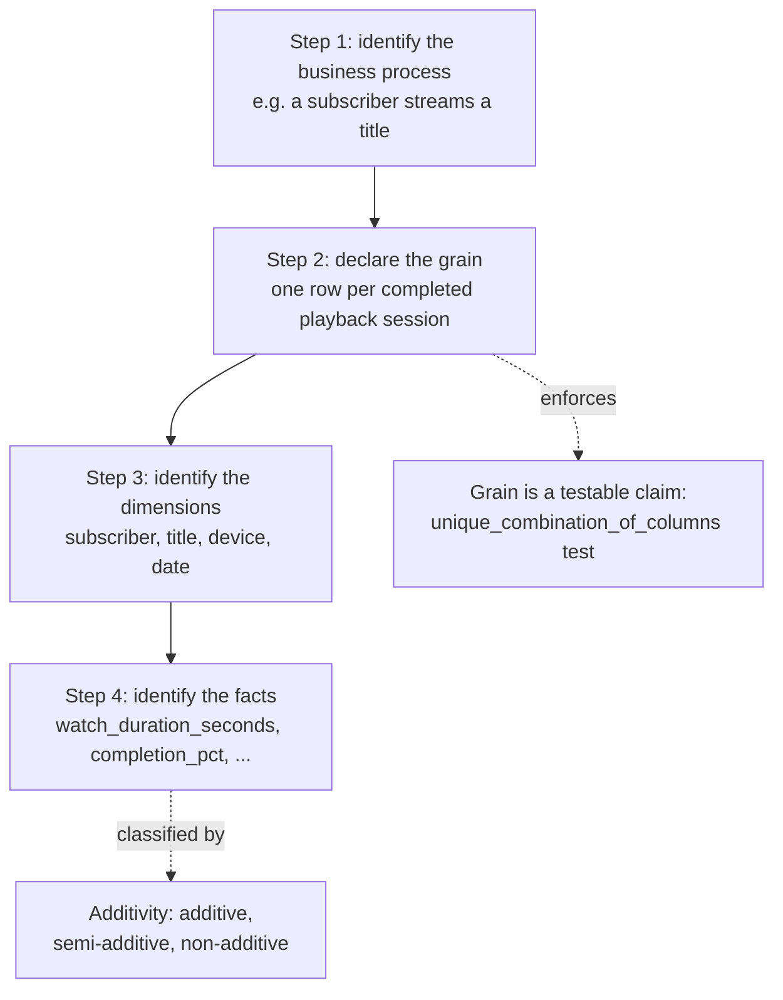

# Kimball dimensional modeling

Ralph Kimball's four-step design process is not a formatting convention for how tables get
named. It is a discipline for converting a business domain into a schema that answers
scan-and-aggregate questions without a bespoke join plan invented per query. This document works
through the process against this project's own bus matrix and grain declarations, not a generic
retelling, then contrasts it honestly with the two methodologies that would have been the
better choice under different constraints, Inmon and Data Vault.

## The problem it solves, stated precisely

An analytical query over a streaming service's data is almost never a lookup by primary key. It
is a filtered, grouped aggregation over a large population: monthly recurring revenue by plan
tier, completion rate by genre and device type, funnel conversion by acquisition channel. Every
one of those questions needs the same three ingredients assembled correctly before it can run: a
population of atomic events or states at a known grain, a small set of numeric measures at that
grain, and a set of business attributes to filter and group by, joined in without duplicating or
dropping rows.

Two failure modes are possible if that assembly is not done deliberately, once, ahead of query
time. The first is a **grain violation**: if a table's rows do not correspond to a single,
unambiguous business fact, joins against it silently multiply or drop rows, and every query
built on top inherits the error without any indication it happened. The second is
**non-conformance**: if two different reports independently build their own version of "the
subscriber dimension," a query that spans both never has a reliable way to say the two are
talking about the same entity, and any dashboard that tries to combine them needs a hand-rolled
reconciliation join, invented and re-verified by whoever writes that specific report.

Kimball's four-step process is a discipline that forecloses both failure modes at design time,
not query time. It does this by fixing a strict order of decisions where each step is only
answerable once the step before it is nailed down, and it is worth taking that order seriously
rather than treating it as an arbitrary checklist.

## The mechanism, from first principles

The four steps, in the order Kimball insists on and this project followed:

1. **Identify the business process.** Not a table, not a report, a real thing the business
   does: a subscriber streams a title, money moves on an account, a prospect works through a
   signup flow. A business process is the unit the rest of the model organizes around.
2. **Declare the grain.** One sentence stating exactly what a single row represents. This has to
   come before dimensions or facts are chosen, because grain is the thing that makes "one row"
   meaningful at all; without it, "which columns identify a row uniquely" and "which columns are
   measures versus attributes" are both undecidable questions.
3. **Identify the dimensions.** Everything that describes the context of one grain-row: who,
   what, when, where, how. Each dimension is chosen because it answers "by what will an analyst
   filter or group this fact."
4. **Identify the facts.** The numeric measurements produced by the business process,
   always expressed *at the declared grain*, never at some other grain smuggled in because a
   number happened to be available.

The ordering is load-bearing, not stylistic. A fact is only meaningful once you know what one
row is: "watch_duration_seconds" is a well-defined additive measure at the grain "one row per
completed playback session," but the same column at the grain "one row per subscriber per day"
would already be an aggregate, and mixing the two grains in one table is exactly the fan-trap
failure mode described above. Declaring the grain first is what makes step 4 checkable rather
than a matter of taste: once the grain is a fixed, literal sentence, "does this measure make
sense at this grain" becomes a yes/no question instead of an argument.

## Applied to this project: the bus matrix as the worked example

This project's bus matrix, from `.notes/modeling.md`, is the artifact that steps 1 and 3 produce
together: rows are business processes, columns are dimensions, and an `x` marks that a process's
facts carry that dimension's foreign key.

| fact                             | subscriber | title | plan | device | payment_method | date roles                        |
|-----------------------------------|:---------:|:-----:|:----:|:------:|:---------------:|-----------------------------------|
| fct_signup_funnel                | x         |       | x    |        |                 | signup + 5 milestone date keys    |
| fct_daily_subscription_snapshot  | x         |       | x    |        |                 | snapshot_date_key                 |
| fct_playback_events              | x         | x     |      | x      |                 | session_date_key                  |
| fct_billing_transactions         | x         |       | x    |        | x               | billing_date_key                  |
| fct_watchlist_adds               | x         | x     |      |        |                 | added_date_key                    |

Walking each row through all four steps, using the exact grain wording the model contract
declares (the wording is not paraphrased here because, as `.notes/modeling.md` itself insists,
the wording carries the meaning):

- **Business process: a subscriber streams a title.** Grain: "one row per completed playback
  session, where a session is one continuous act of one subscriber streaming one title on one
  device." Dimensions: subscriber, title, device, date (session_date_key). Facts:
  `watch_duration_seconds`, `completion_pct`, `buffering_events`, `avg_bitrate_kbps`.
- **Business process: money moves on a subscriber's account.** Grain: "one row per discrete
  billing ledger event (charge, refund, credit, or proration) posted to one subscriber's
  account." Dimensions: subscriber, plan, payment_method, date (billing_date_key). Facts:
  `amount_usd`, `tax_amount_usd`.
- **Business process: subscription state is monitored over time.** Grain: "one row per
  subscriber per calendar day, capturing plan, status, and MRR contribution as of end of day."
  Dimensions: subscriber, plan, date (snapshot_date_key). Facts: `mrr_amount_usd`,
  `tenure_days`.
- **Business process: a prospect works through the signup funnel.** Grain: "one row per
  subscriber signup attempt (`signup_id`), updated in place as the attempt crosses registration,
  email verification, payment-method-added, plan-selected, and first-stream milestones."
  Dimensions: subscriber, plan, six distinct roles of the date dimension. Facts: the four
  `hours_*` lag measures.
- **Business process: a subscriber signals intent to watch something later.** Grain: "one row
  per event of one subscriber adding one title to their watchlist." Dimensions: subscriber,
  title, date (added_date_key). No facts at all beyond the event's own occurrence, a factless
  fact by design.

The grain sentence for `fct_daily_subscription_snapshot` doubles as a testable claim, not just
documentation. Its declared unique key, `(snapshot_date_key, subscriber_sk)`, is enforced
directly in `transform/lakehouse/models/marts/facts/_fct_daily_subscription_snapshot.yml`:

```yaml
- dbt_utils.unique_combination_of_columns:
    combination_of_columns:
      - snapshot_date_key
      - subscriber_sk
    config:
      where: "snapshot_date_key < 20240101"
    name: unique_snapshot_date_key_subscriber_sk_2023
```

repeated for 2024, 2025, and 2026. This is grain declared in step 2, made mechanically
verifiable, which is the entire point of insisting grain comes before facts: a grain that is
only ever asserted in prose can silently drift; a grain expressed as a uniqueness test on the
real columns cannot.

## The math

### Grain as a cardinality bound

Declaring a grain over two dimensions implicitly declares an upper bound on row count: the
Cartesian product of the two dimensions' domains. For `fct_daily_subscription_snapshot`, the
grain is (subscriber, day), so if `S` is the set of subscribers and `D` is the set of days in
the snapshot horizon,

```
N_actual = Σ_{s ∈ S} (min(churn_date_s, horizon) − signup_date_s + 1)
N_upper_bound = |S| × |D|
```

with `N_actual ≤ N_upper_bound`, equality holding only if every subscriber existed for the
entire horizon. `.notes/modeling.md` states the naive estimate as "~50k subscribers x 730 days =
~36.5M rows," `|S| × |D| = 50,000 × 730 = 36,500,000`. The real built table has
27,011,346 rows (`.notes/decisions.md`, verified against a pre-build hand computation and
reconfirmed on every subsequent rebuild), strictly less than the bound, exactly as the inequality
predicts: subscribers who signed up partway through the modeled window, and subscribers who
churned before the horizon's end, each contribute fewer than `|D|` days. The grain declaration
is not just descriptive text; it is a falsifiable arithmetic claim, and the real row count is the
evidence that the model matches its own declared grain rather than some looser, undeclared one.

### Classifying measures by additivity

A measure `m` at a fact's grain is not automatically summable across every dimension it touches.
Given a rollup from grain-level rows to some coarser group (for example, summing across
subscribers, or across days), `m` falls into exactly one of three classes:

- **Fully additive**: `Σ m` over any dimension, including time, is a valid business quantity.
- **Semi-additive**: `Σ m` is valid across some dimensions but not others, most commonly not
  across time, because the measure represents a point-in-time state rather than an event
  quantity.
- **Non-additive**: `Σ m` has no valid business meaning under any grouping; a different
  aggregate (average, weighted average, or a full recomputation from a numerator and
  denominator) is required instead.

This project's own column contracts classify every measure this way, and the classification is
not decorative, it determines what a correct rollup query looks like:

- `watch_duration_seconds` (fully additive): summing across sessions, subscribers, or days all
  produce meaningful totals, "total watch time," at any grouping.
- `mrr_amount_usd` (semi-additive), stated exactly in
  `_fct_daily_subscription_snapshot.yml`: "Additive across subscribers on the same day (sum
  across subscriber_sk for one snapshot_date_key is a valid total MRR for that day), but never
  additive across days (summing one subscriber's mrr_amount_usd over a date range double,
  triple, or N-counts the same recurring revenue for every day it recurred)."
- `completion_pct` (non-additive): a ratio, `watch_duration_seconds / (runtime_minutes * 60)`
  capped at 1.0. Summing percentages across sessions produces a number with no business meaning;
  the correct rollup recomputes the ratio from summed numerators and denominators, or takes a
  weighted average.

Getting this wrong is not a hypothetical risk. A dashboard that sums `mrr_amount_usd` across a
quarter instead of averaging or point-sampling it silently reports a number roughly 90 times too
large (90 days summed instead of one day sampled), and nothing about the column's type or name
prevents that mistake; only the documented additivity classification, checked before writing the
query, does.

## Conformed dimensions: dim_subscriber and dim_date

A conformed dimension is one dimension table, built once with one key namespace and one set of
attribute definitions, referenced by more than one business process. The mechanism it enables is
**drill-across**: running independent queries against two different fact tables, each grouped by
the same conformed dimension's attributes, and combining the results directly, because both
queries are guaranteed to resolve the shared entity to the exact same keys and the exact same
attribute values. Without conformance, each business process's private copy of "subscriber"
might use different keys, different status vocabularies, or different versioning rules, and
combining two reports means first reconciling those two private definitions, a translation layer
invented per report rather than solved once.

This project's bus matrix shows the strongest possible case of conformance: `dim_subscriber` has
an `x` on every single row. All five business processes, streaming, billing, subscription state,
signup, and watchlist intent, resolve their subscriber through the identical dimension, using the
identical point-in-time interval join against `[effective_from, effective_to)`. `dim_date` (and
its role-playing views, `dim_signup_date`, `dim_churn_date`, `dim_billing_date`) is conformed the
same way: every fact in the matrix carries at least one date role resolved against the one
physical `dim_date` table. `docs/01-problem.md` states the practical payoff directly: "a question
like churn-by-genre span[s] two facts (`fct_daily_subscription_snapshot` and
`fct_playback_events`) through `dim_subscriber` without a bespoke join path invented per query."
That sentence is only true because both facts' `subscriber_sk` columns are guaranteed, by
construction, to point into the same dimension rows under the same versioning rules; if either
fact had built its own subscriber lookup, the churn-by-genre question would need a hand-written
reconciliation between two subscriber definitions before it could even be attempted.

`dim_date`'s role-playing views are a stronger form of the same idea: not just the same table
joined by different facts, but the same table joined by different date-typed columns within one
fact, and even within one dimension attribute. `fct_signup_funnel` alone joins six roles of
`dim_date` (the signup attempt date plus five milestone dates). `dim_subscriber.churn_date_key`
joins a seventh role, `dim_churn_date`, from a dimension attribute rather than a fact grain
column, which is the reason that role-playing view exists at all: a role-playing view with no
real consumer does not satisfy the requirement that conformance be demonstrated by an actual
join, so `churn_date_key` was added specifically to give `dim_churn_date` one. The reason this
has to be one physical table with role-specific views, not several independent date tables, is
stated in `docs/04-model.md`: it "keeps the calendar logic (fiscal year, holidays) in exactly
one place rather than duplicated across three physical tables." A fiscal-year rule fixed once in
`dim_date` is correct everywhere it is used in a role; fixed independently in three or six
separate date tables, it is a bug waiting for one of those copies to drift.

## Contrast with Inmon and Data Vault

Kimball is not the only dimensional-modeling-adjacent methodology, and this project's choice of
it was not automatic. Two real alternatives, and an honest accounting of when each would have
been the better call.

**Inmon**: build a normalized, third-normal-form enterprise data warehouse first, as the single
integrated system of record across every source system, then derive departmental dimensional
data marts from that EDW as downstream views or ETL outputs, rather than building marts directly
from source. The payoff is a genuine single source of truth: no dimensional mart can invent its
own conflicting definition of a shared entity, because every mart is derived from the same
normalized layer. The cost is that the EDW has to be built, stabilized, and governed before any
mart can be trusted, which is a much larger upfront modeling and organizational investment, and
a much longer time to the first usable report.

**Data Vault**: model the domain as hubs (business keys only, one per core entity), links
(historized many-to-many associations between hubs), and satellites (all descriptive attributes
and their history, hung off a hub or link, each one an independent insert-only stream). This is
purpose-built for two properties Kimball does not optimize for: auditability, because every row
is an immutable, timestamped insert, so raw source lineage is provably intact and nothing is ever
overwritten or reshaped on load; and load resilience, because a new source system, a new
relationship, or a new attribute can be added as a new hub, link, or satellite without altering
or reprocessing anything that already exists, unlike a star schema where a grain change or a new
dimension attribute can force a rebuild of existing tables. The cost is that raw Data Vault
tables are not queryable by an analyst directly; reassembling one wide, readable entity out of
many narrow satellites at query time is exactly the join-ergonomics problem Kimball solves at
load time, deferred rather than solved.

Stated honestly, without hedging: Inmon would have been the better choice if this project needed
to reconcile genuinely conflicting definitions of "subscriber" or "title" across multiple
independent, pre-existing source systems owned by different teams, with the organizational
capacity to govern a canonical enterprise model over a multi-year horizon. Nothing in this
project's shape matches that: there are nine bronze sources from one synthetic, already-coherent
domain, built by one pipeline, with no competing definitions to reconcile and no multi-year
runway to justify. Data Vault would have been the better choice if the source feeds were
volatile, frequently changing shape or being added and removed over the platform's life, if raw
load-history auditability were a hard regulatory requirement, or if many independent teams needed
to load in parallel without contending for the same tables. This project's actual audit
requirement, provable history of what was loaded and when, is already satisfied at the
storage and catalog layer by Iceberg's snapshot history and Nessie's branch commits (this
project's write-audit-publish and time-travel mechanisms, see `docs/06-tradeoffs.md`), not by
hub/link/satellite modeling at the schema layer, and there is no multi-team concurrent-load
contention to design around, since bronze ingestion here is a single controlled pipeline.

Kimball fit because this is a from-scratch analytical build with one team, one already-cleaned
source set, and a small, fully enumerable list of business processes, exactly the shape a bus
matrix can express completely in five rows. Its entire mechanism, resolve the join topology once
at load time and hand the analyst pre-joined, pre-labeled facts and dimensions, is optimized for
reaching a directly queryable, scan-and-aggregate-ready schema in one modeling pass, which is
what this project's own stated goal (`docs/01-problem.md`) actually needed, and neither Inmon's
integration-first discipline nor Data Vault's audit-first discipline was solving a problem this
project actually has.



## When it fails, and the counter-indications

The four-step process only produces a correct model if the assumptions fed into steps 1 through
3 are actually true of the real data, and Kimball's methodology has no built-in mechanism to
verify that; the design pass can only encode an assumption, not validate it against volume the
model has not yet seen. This project has a real, measured example of exactly that gap.
`dim_title`'s design (`.notes/modeling.md`) deliberately omits the late-arriving self-heal
mechanism `dim_subscriber` has, on the stated premise that "titles arrive from a controlled
catalog feed ahead of playback." Verified against the real built table, that premise does not
hold at meaningful scale: 4,833 of `dim_title`'s 5,000 titles have their first catalog version
dated after some of their own playback sessions, and the consequence is that 20,646,958 rows,
17.3% of the entire 119.6-million-row `fct_playback_events` table, resolve `title_sk` to the
unknown member instead of a real title version (`.notes/decisions.md`, 2026-08-04). The join
logic itself was implemented exactly as specified and behaves correctly given its inputs; the
failure is upstream of the join, in a step-1/step-3 assumption about how titles and playback
events actually relate in time, which nothing in the four-step process itself would have caught
before the pipeline ran against real volume.

More generally, Kimball dimensional modeling is the wrong tool when:

- **The business processes are not yet stable or fully enumerable.** A bus matrix is a
  commitment to a fixed list of processes and their shared dimensions; if that list is still
  being discovered, or reshapes every quarter, locking in a bus matrix early locks in the wrong
  shape.
- **Conformance is not actually achievable.** If an organization has genuinely divergent,
  competing definitions of the same entity across departments, Kimball alone, without an
  Inmon-style integration layer underneath it, produces marts that each conform internally but
  disagree with each other.
- **The workload is operational, not analytical.** Single-record lookups and writes are an OLTP
  problem; a star schema is built for scan-and-aggregate, not point access, a distinction
  `docs/01-problem.md` makes explicitly for this project's own source systems.
- **Auditability of raw load history, not just business state, is the primary requirement.**
  Kimball's SCD mechanisms track business-attribute history, not full insert-level provenance;
  that is Data Vault's job, or in this project's case, the catalog layer's job.

## How to verify it is actually working

Grain integrity, conformance, and additivity are not just design-time claims in this project;
each one has a concrete, reproducible check against the real build.

**Grain uniqueness**, the direct test of step 2: `dbt test --select fct_daily_subscription_snapshot --target trino`
runs the four year-partitioned `unique_combination_of_columns` tests quoted above; the real run
passed all four "in 0.5-11.3s each" against the live 27,011,346-row table
(`.notes/decisions.md`). A grain that has drifted from its declaration fails this test loudly,
not silently.

**Conformance**, the direct test of step 3: `dim_subscriber` is `ref()`'d by every one of the
five facts, which is directly inspectable in the dbt DAG (`dbt list --select dim_subscriber+`),
and independently confirmed in this project's own captured evidence,
`docs/evidence/dagster/03-materialize-dim-subscriber-cli.log`, which records 23 dbt data tests
passing on a real materialization of `dim_subscriber`, "including relationships tests against
fct_playback_events, fct_billing_transactions and fct_watchlist_adds." A relationships test
passing from three independent fact tables into the same dimension's surrogate key is a direct,
mechanical proof that all three resolve the same conformed entity through the same keys, not an
assumption about the design.

**Additivity**, verifiable by direct query: to confirm `mrr_amount_usd` behaves as documented,
run

```sql
select snapshot_date_key, sum(mrr_amount_usd) as total_mrr
from iceberg.dev_facts.fct_daily_subscription_snapshot
where snapshot_date_key = 20260803
group by snapshot_date_key;
```

a valid single-day total, against

```sql
select subscriber_sk, sum(mrr_amount_usd) as bogus_multi_day_sum
from iceberg.dev_facts.fct_daily_subscription_snapshot
where subscriber_sk = '<some subscriber>'
group by subscriber_sk;
```

which produces a number with no business meaning for any subscriber with more than one row, the
concrete demonstration of why the column is documented semi-additive rather than additive.

**The counter-example**, for the failure mode described above: `select count(*) from iceberg.dev_facts.fct_playback_events where title_sk = md5('-1')`
reproduces the 17.3% unknown-title figure directly against the live table, which is the
verification that this is a real, measured, reproducible finding, not an estimate.
