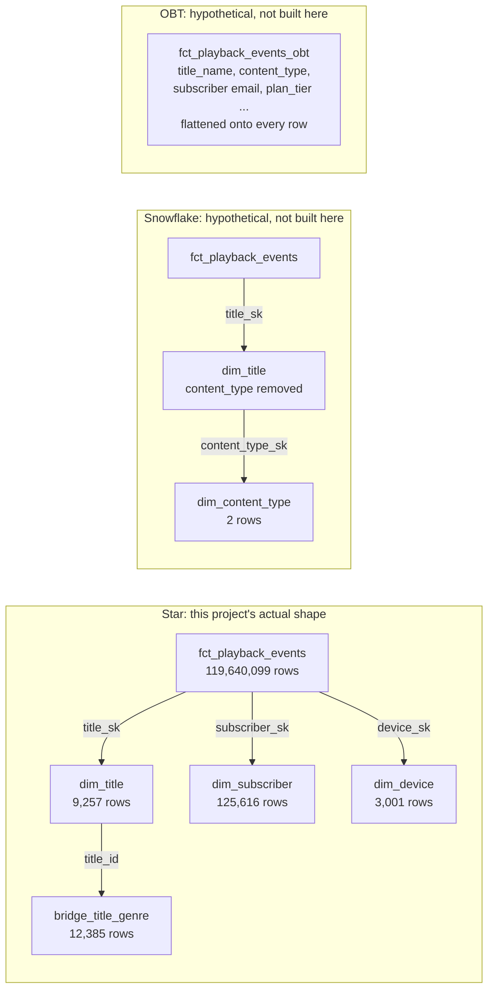

# Star, snowflake, and one big table

Once the Kimball process (`docs/03-theory/01-kimball-dimensional-modeling.md`) has fixed a
fact's grain and its dimensions, one physical decision remains: how normalized should each
dimension be, and how much of a dimension's attributes, if any, should be copied directly onto
the fact row itself. Three candidate shapes answer that differently: the star schema this
project built, the snowflake schema it deliberately did not, and one big table (OBT), which it
also did not build but which is a real, sometimes-correct alternative worth reasoning about
honestly rather than dismissing on convention.

## The problem it solves, stated precisely

A star, a snowflake, and an OBT can all express the identical grain and the identical business
attributes; none of the three changes what question the model can answer. What they change is
where the join work happens and how many times a piece of information is physically stored. A
snowflaked dimension moves join work from load time to query time by normalizing a dimension's
own attributes into further sub-tables. An OBT moves join work from query time to load time by
pre-flattening dimension attributes directly onto every fact row, so no join is needed at read
time at all. A star schema sits between the two: dimensions are fully denormalized (one flat
table each), and a fact resolves each one with exactly one join hop, no more, no less.

The question this document answers precisely is not "which shape is more correct," they are all
equally correct representations of the same business model, but "which shape minimizes total
cost, storage plus query latency plus maintenance burden, for this project's actual engine
(Trino over Iceberg/Parquet, columnar, single-node, a hard 1.5GB per-query memory cap) and this
project's actual scale (a 119.6-million-row dominant fact against dimensions ranging from under
100 rows to 125,616 rows)." The answer is not the same answer 1990s relational-warehouse
literature gives, because the physical storage model that literature was reasoning about is not
the one this project runs on, and the difference is concrete and measurable, not theoretical.

## The mechanism, from first principles

Structurally, using this project's own `fct_playback_events` and `dim_title`:

- **Star** (what this project built): `fct_playback_events` carries `title_sk`, a foreign key
  pointing directly at `dim_title`, a single flat table holding every tracked title attribute
  (`title_name`, `content_type`, `release_year`, `runtime_minutes`, `maturity_rating`,
  `original_language`, `is_original`). One join hop resolves every one of those attributes.
- **Snowflake** (hypothetical, not built here): some of `dim_title`'s own attributes are further
  normalized into their own sub-dimension tables, linked by their own foreign keys. For example,
  `content_type` (domain: `movie`, `series`, per `.notes/modeling.md`) could be pulled out into a
  `dim_content_type` table and replaced on `dim_title` with a `content_type_sk`. Resolving
  `content_type` for a playback row now costs two join hops: fact to `dim_title`, `dim_title` to
  `dim_content_type`.
- **OBT** (hypothetical, not built here): `dim_title`'s attributes are not referenced by key at
  all; they are copied directly onto every `fct_playback_events` row at load time. Reading
  `content_type` for a playback session costs zero joins, at the cost of storing that value
  redundantly on every row that references the same title.



## The math: join cost and why it changed

### The row-store argument this methodology was written against

Kimball's original "minimize joins" guidance, and the classical case against snowflaking, was
formed against row-major storage: a table's rows are stored physically together, one full row
per disk page slot, every column included whether or not a given query needs it. Reading any
column of a row means paying the I/O cost of the whole row (and typically the whole page around
it), because the storage engine has no way to fetch "only this column." Formally, for a row of
width `W` bytes, a page of size `P` bytes holds roughly `P / W` rows, and a query that touches
even one column of `N` matching rows pays I/O proportional to `N × W`, the full row width, not
the width of the columns actually referenced. Every additional join hop in a snowflaked design
adds a second full-row-width fetch on top of the first, for a marginal storage saving on the
normalized column. That is the real arithmetic behind "minimize joins": in a row store, a join
hop's cost is dominated by row-width I/O that has nothing to do with how much of the row a query
actually needs.

### The columnar argument this project actually runs under

Parquet, the file format underneath every Iceberg table in this stack, stores each column in its
own contiguous, independently compressed and encoded byte stream per row group, not one row at a
time. A query's projected column list determines which column streams get decoded at all
(**column pruning**); Parquet's own per-row-group statistics (min, max, null count), and
Iceberg's manifest-level per-file column bounds one layer above that, let the engine test a
predicate against a row group or an entire file's stats and skip decoding it entirely if the
predicate cannot match anything in that range (**predicate pushdown** and **file pruning**). The
unit of I/O cost is no longer "a row," it is "a column chunk, decoded only if it is projected or
needed to evaluate a pushed-down predicate." A join against a small, narrow dimension table costs
roughly proportional to that dimension's own referenced columns and row count, not to the fact
table's width, so an extra hop to a genuinely small dimension is close to free in absolute terms,
regardless of how many hops away it sits.

This is not an abstract claim here; it is exactly what this project's own build measured. Getting
`fct_playback_events` to build without exceeding Trino's 1.5GB per-query memory cap required
narrowing the base scan from the source table's full column width down to the nine columns the
fact actually needs, which the model's own header comment documents directly:

```
-- A single full scan of bronze_playback_sessions (or the stg view over it)
-- at the full ~16-column row width costs approximately 1.47 to 1.50GB ...
-- What did work reliably: narrowing the projected column set.
```

and once that narrow projection was in place, adding the three dimension joins on top cost
almost nothing:

```
Two range joins (dim_subscriber ~125,616 rows, dim_title ~9,257 rows, both small enough to
broadcast cheaply) plus one equality join (dim_device ~3,001 rows) rode on top of the narrowed
scan without pushing memory over the cap; the prior work package's 1.47-1.50GB full-width-scan
finding turned out to be specific to scanning the full column width, not to joins against small
dimensions layered on a narrow projection.
```

(`.notes/decisions.md`, 2026-08-04). That sentence is the whole argument of this section,
confirmed against real infrastructure rather than asserted: on this engine, at this project's
real scale, the cost driver that actually bit was column width of the widest scan, not the
number of join hops. Three joins against small, columnar-pruned dimensions cost nothing
additional once the wide scan itself was fixed.

## Snowflaking versus a bridge table: two different concepts that both add a hop

`dim_title`'s genre relationship is many-valued, real data shows 1 to 4 genres across all 5,000
titles, 12,385 `(title_id, genre_name)` pairs in total. It is tempting to describe this as "a
snowflaked genre dimension," and both a snowflake and this project's actual `bridge_title_genre`
table add a join hop beyond the fact-to-dimension join, but they solve categorically different
problems and the distinction matters.

**Snowflaking is an optional storage decision on a many-to-one attribute.** It only applies where
a dimension row maps to exactly one value of the attribute being pulled out, because a foreign
key column, by definition, can hold exactly one value per row. `content_type` is a real,
concrete candidate: every `dim_title` row has exactly one `content_type` (domain: `movie`,
`series`), so it could, in principle, be normalized into a two-row `dim_content_type` table.
Whether that is worth doing is purely an arithmetic tradeoff between the storage it saves and the
hop it costs, and at this project's scale the arithmetic is decisively against it: `dim_title`
has 9,257 rows total, so normalizing a two-valued `content_type` column out of it saves, at the
absolute most, the difference between storing a short string and a hashed key across 9,257 rows,
a saving Parquet's own dictionary encoding of a two-distinct-value column already claims almost
entirely before any schema change, while the join hop this buys is paid by every query that ever
touches `content_type`, forever. None of this project's six dimensions (`dim_payment_method` at
under 100 rows up to `dim_subscriber` at 125,616) is large enough, or carries wide enough
repeated text, for a snowflaking decision to net positive.

**A bridge table exists to represent a many-to-many relationship that a foreign key column
cannot express at all**, independent of any storage argument. `dim_title`'s own grain is one row
per title per metadata version; a title with more than one genre cannot be represented by adding
a `genre_sk` column to `dim_title`; that column can only ever hold one value per row. Either the
relationship is resolved in a separate table keyed on the pair, or information is discarded (keep
only a "primary" genre and drop the rest). This project's own model comment states the reasoning
directly:

```
-- A title can carry more than one genre (real data: 1 to 4 genres across 5,000 titles, 12,385
-- rows total), so genre cannot live as a plain attribute on dim_title without either violating
-- dim_title's one-row-per-metadata-version grain or arbitrarily keeping only one genre and
-- losing the rest. A bridge table resolves the many-to-many relationship without duplicating
-- dim_title rows.
```

(`transform/lakehouse/models/marts/facts/bridge_title_genre.sql`). Note also that the bridge is
keyed on `title_id`, `dim_title`'s natural key, not `title_sk`, its surrogate key, a second
design choice orthogonal to snowflaking: because genre assignment is not itself history-tracked,
keying on the natural key means a new `dim_title` SCD version never forces re-emitting bridge
rows. A fact reaches the bridge through `dim_title` (`title_sk` to resolve the version, then
`title_id` to reach the bridge), which is structurally the same two-hop shape a snowflake would
have, but the reason for the hop is representational necessity, not a storage tradeoff, and no
amount of storage cheapness would make the many-to-many problem disappear by choosing a
different physical layout.

That representational cost has its own consequence, `allocation_weight`, which exists precisely
because a bridge (unlike a plain FK) can attach a fact to more than one dimension row per join:

```
-- The allocation_weight mechanism exists so a weighted fact query, one that joins a fact to
-- this bridge on title_id and multiplies its measure by allocation_weight, does not double
-- count: a title with three genre rows would otherwise triple its contribution to any measure
-- summed by genre.
```

verified with real data tests: `(title_id, genre_name)` unique, `sum(allocation_weight)` equal
to `1.0000` per `title_id` (real build: exact for all 5,000 titles, zero exceptions), and exactly
one `is_primary_genre` row per `title_id`. This is a cost a snowflake never has to pay, because a
snowflaked (many-to-one) join can never fan a fact row out to more than one match in the first
place; it is the direct, unavoidable price of correctly modeling a many-to-many relationship, not
a defect of this particular bridge.

## When predicate pushdown does not save you

Column pruning and predicate pushdown are not magic; both depend on the query's predicate shape
and the data's physical layout matching the assumption the optimizer needs. This project hit
both limits directly while building the same table discussed above.

**Pushdown depends on the predicate being a direct comparison, not a derived expression.** An
earlier draft of the playback quality gate filtered on a `CASE`-derived `rejection_reason`
column; Trino could not push that filter down to the Iceberg connector the way it pushes plain
column comparisons, and the resulting scan blew the 1.5GB memory cap even though the equivalent
direct-comparison predicate did not. The fix, kept as a macro rather than a computed column, is
explicit about the mechanism:

```sql
-- shared malformed-row predicate for the playback quality gate, kept as a macro rather than an
-- upstream computed column deliberately: routing the filter through a derived rejection_reason
-- column defeats Iceberg predicate pushdown on this ~120M-row table (Trino cannot push a CASE
-- expression down to the connector the way it pushes direct column comparisons)

    (watch_duration_seconds < 0 or session_ended_at < session_started_at or session_started_at > _ingested_at)

```

(`transform/lakehouse/macros/playback_malformed_predicate.sql`). Predicate pushdown is a real,
measured effect on this infrastructure, but it is not automatic; how a predicate is expressed in
SQL determines whether the optimizer can use it at all.

**File-level pruning depends on the data actually being clustered by the pruned column.**
`fct_playback_events`'s source data deliberately injects out-of-order arrival (3% of rows moved
3 to 15 batches later than their true chronological slice, `.notes/decisions.md`'s pathology 6),
which means file-level min/max statistics on `session_started_at` are not tight: a file written
late in the load can still contain rows from years earlier. The consequence, measured directly:

```
Date-range chunking (WHERE session_started_at < literal) does not reduce the scanned volume at
all: EXPLAIN (TYPE IO) on a query bounded to the first five months of a 4.5-year range still
estimated scanning all 120,000,300 rows.
```

Predicate pushdown on `session_started_at` cannot skip a single file here, because every file's
min/max range spans nearly the whole table once out-of-order rows are mixed in. Column pruning
and predicate pushdown reduce cost relative to the physical layout the data actually has, not
relative to the logical query being asked; a poorly clustered column gets none of the benefit no
matter how selective the predicate looks on paper.

## When one big table is the right call, and why this project did not build one

An OBT collapses the star schema's dimension joins by copying dimension attributes directly onto
the fact at load time. It is the right choice when the BI layer consuming the table cannot
express joins at all (a flat pivot tool, a spreadsheet export), when exactly one query shape is
known in advance and no other access pattern will ever be run against the table, or when the
attributes being flattened are low-cardinality and effectively static, so denormalization never
creates a correction that has to chase down and rewrite existing rows.

`fct_playback_events` is, in principle, a candidate: it is this project's largest and
most-queried fact, and every one of its dimension joins is cheap in isolation (the section above
demonstrates that directly). The real tradeoff is not query-time join cost, which this project's
own build already shows is close to negligible against small, columnar-pruned dimensions; it is
storage redundancy and, more importantly, update propagation.

**Storage redundancy, computed exactly from this project's own real counts, not an illustrative
estimate.** `dim_title`'s seven tracked attributes (`title_name`, `content_type`, `release_year`,
`runtime_minutes`, `maturity_rating`, `original_language`, `is_original`) and `dim_subscriber`'s
five Type 1 mirror attributes (`email`, `display_name`, `country_code`, `acquisition_channel`,
`current_plan_tier`) are twelve columns of dimension attribute data. In the star schema, each
value is stored once per dimension version: `9,257 × 7 = 64,799` title-attribute values plus
`125,616 × 5 = 628,080` subscriber-attribute values, `692,879` values total. Flattened directly
onto every one of `fct_playback_events`'s real `119,640,099` rows instead of referenced by a
32-character surrogate key, the same twelve logical columns would require
`119,640,099 × 12 = 1,435,681,188` stored values, a redundancy factor of

```
1,435,681,188 / 692,879 ≈ 2,072
```

the same twelve attributes stored roughly two thousand times more often than the star schema
needs to store them, purely as a function of real row and column counts, independent of any
assumption about byte width or compression. Parquet's dictionary and run-length encoding will
compress away most of that redundancy for genuinely low-cardinality columns like `content_type`
(2 distinct values) or `current_plan_tier` (a handful of tiers), but it cannot rescue
high-cardinality, near-unique-per-entity text like `email` or `display_name`, which stays close
to its full logical redundancy on disk regardless of encoding.

**Update propagation is the sharper cost, and it is a correctness cost, not just a size cost.**
`docs/04-model.md` describes `fct_playback_events` as a transaction fact, "immutable once
written." In the star schema this is a real, load-bearing property: a correction to a
subscriber's `display_name` touches only that subscriber's row(s) in `dim_subscriber`, a
125,616-row table, and `fct_playback_events` is never touched, stays append/merge-only, and its
immutability holds by construction. Under an OBT shape, the identical correction would require
locating and rewriting every one of that subscriber's own rows in the 119.6-million-row fact,
potentially thousands of rows for an active subscriber, which breaks the immutability invariant
the transaction fact is designed around and turns a single-row dimension update into a partial
rewrite of the platform's largest table. Type 2 history makes this worse, not better: a
correction to one historical version of `dim_title` (a metadata fix to a version that is no
longer current) would, under OBT, require re-deriving exactly which historical fact rows fell
inside that version's `[effective_from, effective_to)` interval and rewriting only those, which
is precisely the point-in-time join logic the star schema already resolves once, cheaply, at
fact load time, being paid again on every subsequent dimension correction instead of once.

**Why the star schema was the right call here regardless of the raw cost numbers.** This project
exists to demonstrate dimensional modeling literacy: conformed dimensions shared across five
business processes, three SCD types plus a Type 6 hybrid, a junk dimension, a bridge table, and
role-playing date dimensions, all covered in
`docs/03-theory/01-kimball-dimensional-modeling.md`. An OBT shape does not make any of those
techniques cheaper here, it makes them structurally invisible: there is no separate dimension
left to version, no bridge left to demonstrate resolving a many-to-many relationship, and no
conformed dimension shared across facts, because there would be only one flat, denormalized fact
table left to look at. Even setting the real storage and update-propagation costs aside, choosing
OBT would have optimized away the exact thing this project was built to show working.

## Counter-indications: when a star schema is the wrong call

- **The consuming BI layer genuinely cannot join.** Some lightweight dashboard connectors and
  spreadsheet-style tools query one flat table only; a star schema is unusable to them regardless
  of how cheap the join is on the engine side, and OBT (or a pre-joined reporting view) is the
  only shape that actually works.
- **A single, narrow, permanently fixed query shape is the only workload.** If a table serves
  exactly one report forever, a star schema's flexibility, the ability to reuse the same
  dimensions in new combinations, is a benefit that is never exercised, and pre-flattening for
  that one query removes join cost with no offsetting loss.
- **A dimension is genuinely large and its attributes are genuinely wide and repetitive.** None
  of this project's dimensions qualify (largest is 125,616 rows), but a dimension with millions
  of rows and long repeated text blocks is exactly the case where snowflaking's storage argument
  starts to outweigh its join cost, particularly on a row-oriented engine.
- **Point-lookup, low-latency serving, not batch analytics.** A star schema (or any of these
  three shapes) is a warehouse pattern for scan-and-aggregate; a system needing sub-millisecond
  single-record reads needs an entirely different, OLTP-shaped design, not a choice among these
  three.

## How to verify it is actually working

**Column pruning and its real cost boundary**: rerun the exact comparison this project's own
build already performed. Scanning `bronze_playback_sessions` (or `stg_playback_sessions`) at
full ~16-column width costs approximately 1.47 to 1.50GB, against the 1.5GB per-node cap
(`infra/trino/etc/config.properties`); the narrowed 9-column projection this project's models
actually use fits comfortably. Reproduce directly:

```sql
EXPLAIN (TYPE IO)
select playback_session_id, subscriber_id, title_id, session_started_at, watch_duration_seconds
from iceberg.dev_silver.silver_playback_sessions
where watch_duration_seconds < 0;
```

against the same predicate over `select *`, and compare the estimated scanned column set in the
plan output.

**Predicate pushdown**: revert `macros/playback_malformed_predicate.sql`'s inlined comparisons
to a `CASE`-derived `rejection_reason` column and rerun `silver_playback_sessions_rejected`; the
project's own history records this reliably exceeding the memory cap, which is the reproducible
negative case for the pushdown claim.

**File pruning failing under the out-of-order pathology**:

```sql
EXPLAIN (TYPE IO)
select count(*) from iceberg.dev_silver.silver_playback_sessions
where session_started_at < timestamp '2023-06-01 00:00:00';
```

against the real table; the estimate scans effectively the full `120,000,300` rows rather than a
pruned subset, confirming file-level stats are not tight enough on this column for the optimizer
to skip files.

**The bridge table's own grain and weight-sum guarantees**, the direct test that the many-to-many
relationship is being modeled correctly rather than silently double-counted:

```
dbt test --select bridge_title_genre --target trino
```

runs the composite-uniqueness, `sum(allocation_weight) = 1.0000`, and single-`is_primary_genre`
tests; the real build passed all eight tests both times it was run, `12,385` rows both runs,
identical per-title aggregate checks (`.notes/decisions.md`).

**The OBT redundancy factor**, directly recomputable against the live warehouse rather than
taken on faith:

```sql
select count(*) from iceberg.dev_facts.fct_playback_events;      -- 119,640,099
select count(*) from iceberg.dev_dimensions.dim_title;            -- 9,257
select count(*) from iceberg.dev_dimensions.dim_subscriber;       -- 125,616
```

feeding the same arithmetic worked through above, a live, rerunnable confirmation rather than a
static claim.
