# The dimensional model

Gold layer only. Six conformed dimensions, one bridge table, five facts, three role-playing
date views. Column-level source of truth is `.notes/modeling.md` (gitignored working contract);
this document is the durable, public description of the same model, checked against the models
actually built under `transform/lakehouse/models/marts/`.

Types below are Trino types over Iceberg v2: `VARCHAR`, `INTEGER`, `BIGINT`, `DECIMAL(p,s)`,
`DATE`, `TIMESTAMP(6)`, `BOOLEAN`.

## Bus matrix

| fact                             | subscriber | title | plan | device | payment_method | date roles                     |
|-----------------------------------|:---------:|:-----:|:----:|:------:|:---------------:|---------------------------------|
| fct_signup_funnel                | x         |       | x    |        |                 | signup + 5 milestone date keys  |
| fct_daily_subscription_snapshot  | x         |       | x    |        |                 | snapshot_date_key               |
| fct_playback_events              | x         | x     |      | x      |                 | session_date_key                |
| fct_billing_transactions         | x         |       | x    |        | x               | billing_date_key                |
| fct_watchlist_adds               | x         | x     |      |        |                 | added_date_key                  |

`bridge_title_genre` attaches genres to `dim_title` through the title natural key, not through
a fact, so it does not appear as its own row in the matrix.

## Grain declarations

Each fact's grain is a single sentence, worded exactly as the model contract states it, because
the wording carries real meaning (what one row represents, what makes a row unique).

- **fct_playback_events**: one row per completed playback session, where a session is one
  continuous act of one subscriber streaming one title on one device.
- **fct_billing_transactions**: one row per discrete billing ledger event (charge, refund,
  credit, or proration) posted to one subscriber's account.
- **fct_daily_subscription_snapshot**: one row per subscriber per calendar day, capturing plan,
  status, and MRR contribution as of end of day.
- **fct_signup_funnel**: one row per subscriber signup attempt (`signup_id`), updated in place
  as the attempt crosses registration, email verification, payment-method-added, plan-selected,
  and first-stream milestones, until the funnel completes or expires.
- **fct_watchlist_adds**: one row per event of one subscriber adding one title to their
  watchlist.

## Entity-relationship diagram

```mermaid
erDiagram
    DIM_SUBSCRIBER ||--o{ FCT_PLAYBACK_EVENTS : subscriber_sk
    DIM_TITLE      ||--o{ FCT_PLAYBACK_EVENTS : title_sk
    DIM_DEVICE     ||--o{ FCT_PLAYBACK_EVENTS : device_sk
    DIM_DATE       ||--o{ FCT_PLAYBACK_EVENTS : session_date_key

    DIM_SUBSCRIBER ||--o{ FCT_BILLING_TRANSACTIONS : subscriber_sk
    DIM_PLAN       ||--o{ FCT_BILLING_TRANSACTIONS : plan_sk
    DIM_PAYMENT_METHOD ||--o{ FCT_BILLING_TRANSACTIONS : payment_method_sk
    DIM_DATE       ||--o{ FCT_BILLING_TRANSACTIONS : billing_date_key

    DIM_SUBSCRIBER ||--o{ FCT_DAILY_SUBSCRIPTION_SNAPSHOT : subscriber_sk
    DIM_PLAN       ||--o{ FCT_DAILY_SUBSCRIPTION_SNAPSHOT : plan_sk
    DIM_DATE       ||--o{ FCT_DAILY_SUBSCRIPTION_SNAPSHOT : snapshot_date_key

    DIM_SUBSCRIBER ||--o{ FCT_SIGNUP_FUNNEL : subscriber_sk
    DIM_PLAN       ||--o{ FCT_SIGNUP_FUNNEL : plan_sk
    DIM_DATE       ||--o{ FCT_SIGNUP_FUNNEL : signup_date_key
    DIM_DATE       ||--o{ FCT_SIGNUP_FUNNEL : registered_date_key
    DIM_DATE       ||--o{ FCT_SIGNUP_FUNNEL : email_verified_date_key
    DIM_DATE       ||--o{ FCT_SIGNUP_FUNNEL : payment_method_added_date_key
    DIM_DATE       ||--o{ FCT_SIGNUP_FUNNEL : plan_selected_date_key
    DIM_DATE       ||--o{ FCT_SIGNUP_FUNNEL : first_stream_date_key

    DIM_SUBSCRIBER ||--o{ FCT_WATCHLIST_ADDS : subscriber_sk
    DIM_TITLE      ||--o{ FCT_WATCHLIST_ADDS : title_sk
    DIM_DATE       ||--o{ FCT_WATCHLIST_ADDS : added_date_key

    DIM_TITLE ||--o{ BRIDGE_TITLE_GENRE : title_id
    DIM_SUBSCRIBER ||--o{ DIM_DATE : churn_date_key

    DIM_SUBSCRIBER {
        varchar subscriber_sk PK
        varchar subscriber_id
        varchar plan_tier
        varchar status
        varchar current_plan_tier
        varchar previous_plan_tier
        int churn_date_key FK
        timestamp effective_from
        timestamp effective_to
        boolean is_current
    }
    DIM_TITLE {
        varchar title_sk PK
        varchar title_id
        varchar title_name
        varchar content_type
        timestamp effective_from
        timestamp effective_to
        boolean is_current
    }
    DIM_PLAN {
        varchar plan_sk PK
        varchar plan_id
        varchar current_tier
        varchar previous_tier
        decimal current_price_usd
        decimal previous_price_usd
    }
    DIM_DEVICE {
        varchar device_sk PK
        varchar device_id
        varchar device_type
        boolean is_mobile
    }
    DIM_PAYMENT_METHOD {
        varchar payment_method_sk PK
        varchar payment_type
        boolean is_promo_applied
        boolean is_retry
        boolean is_autopay
    }
    DIM_DATE {
        int date_key PK
        date date_day
        int fiscal_year
        boolean is_holiday
    }
    BRIDGE_TITLE_GENRE {
        varchar title_id FK
        varchar genre_name
        decimal allocation_weight
        boolean is_primary_genre
    }
    FCT_PLAYBACK_EVENTS {
        varchar playback_session_id PK
        varchar subscriber_sk FK
        varchar title_sk FK
        varchar device_sk FK
        int session_date_key FK
        int watch_duration_seconds
    }
    FCT_BILLING_TRANSACTIONS {
        varchar billing_transaction_id PK
        varchar subscriber_sk FK
        varchar plan_sk FK
        varchar payment_method_sk FK
        int billing_date_key FK
        decimal amount_usd
    }
    FCT_DAILY_SUBSCRIPTION_SNAPSHOT {
        int snapshot_date_key PK,FK
        varchar subscriber_sk PK,FK
        varchar plan_sk FK
        varchar subscription_status
        decimal mrr_amount_usd
    }
    FCT_SIGNUP_FUNNEL {
        varchar signup_id PK
        varchar subscriber_sk FK
        varchar plan_sk FK
        int signup_date_key FK
        varchar funnel_status
    }
    FCT_WATCHLIST_ADDS {
        varchar watchlist_event_id PK
        varchar subscriber_sk FK
        varchar title_sk FK
        int added_date_key FK
    }
```



`dim_signup_date`, `dim_churn_date`, and `dim_billing_date` are role-playing views over
`dim_date` and are omitted from the diagram as separate entities to keep it readable; each is
`dim_date` with `date_key` and `date_day` aliased to `<role>_date_key` / `<role>_date`, every
other column passed through unchanged.

## Every table, justified

### dim_date (physical table) and its role-playing views

Grain: one row per calendar day, 2023-01-01 through 2027-12-31, plus a fiscal calendar (fiscal
year starts July 1, labeled by the ending calendar year) and US federal holiday flags on their
actual calendar date, not the federal-employee observed-date shift. Built with
`dbt_utils.date_spine`, verified against a real off-by-one in that macro's own
`get_intervals_between` (an exclusive day-count that silently drops the declared last day unless
`end_date` is passed one day past the desired inclusive bound); fixed and reverified against the
real built table.

There is no separate `dim_genre`, `dim_signup_date`, etc. as physical tables beyond the three
listed here: `dim_signup_date`, `dim_churn_date`, and `dim_billing_date` are role-playing SQL
views over the one physical `dim_date` table. A role-playing view exists specifically because
the same date dimension answers different business questions depending on which fact or
attribute is joining to it (when did this event happen, versus when did this subscriber
churn), and a single shared `dim_date` with role-specific aliases keeps the calendar logic
(fiscal year, holidays) in exactly one place rather than duplicated across three physical
tables. `dim_churn_date` is the one role-playing view whose only consumer is a dimension
attribute (`dim_subscriber.churn_date_key`) rather than a fact grain column: the original
build wired up only `dim_signup_date` and `dim_billing_date` against fact tables and left
`dim_churn_date` with no real consumer, which does not satisfy the requirement that a
role-playing view exist because something actually joins to it. The fix added
`churn_date_key` to `dim_subscriber` as a Type 1 mirror, giving `dim_churn_date` a genuine
join target.

### dim_subscriber (Type 6 hybrid)

Grain: one row per subscriber per tracked-attribute version, where a version begins whenever
`plan_tier` or `status` changes. Roughly 50,000 entities, roughly 200,000 rows with history.

Type 6 fits here because the business needs two different questions answered by the same
dimension: "what was this subscriber's plan and status at the moment of this playback session"
(a Type 2 question, needs full version history) and "what is this subscriber's plan right now,
regardless of which historical row I'm looking at" (a Type 1 question, needs every row updated
in place). A pure Type 2 dimension can't answer the second question without a separate
current-row lookup; a pure Type 1 dimension can't answer the first at all because it keeps no
history. Type 6 (the "hybrid" naming blends 1 + 2 + 3) answers both from one row: `plan_tier`
and `status` are Type 2 tracked (drive versioning, appear in `row_hash`), `email`,
`display_name`, `country_code`, `acquisition_channel`, and `current_plan_tier` are Type 1
(overwritten across every historical row of a subscriber on each change), and
`previous_plan_tier` is Type 3 (one step of prior-value history, derived from the change
itself, not separately tracked). `churn_date_key` gets the same Type 1 treatment: it is set on
the version where `status` first becomes `churned` and mirrored onto every historical row of
that subscriber, and cleared back to NULL on every row if the subscriber reactivates, because
it answers "did this subscriber ever churn and on what date," a fact about the subscriber, not
about one version of them.

Late-arriving subscribers get an inferred row (`subscriber_sk = md5(subscriber_id,
TIMESTAMP '1900-01-01 00:00:00.000000')`, `is_inferred = true`, all descriptive attributes
`NULL` or `'unknown'`) rather than being parked or sent to the unknown member, so a fact
referencing a not-yet-loaded subscriber still gets a real, stable key that survives the
subscriber's eventual backfill without any fact re-keying.

### dim_title (Type 2)

Grain: one row per title per metadata version, where a version begins whenever any tracked
metadata or rating attribute changes. Roughly 5,000 entities; the real build produced 9,256
history rows (not the "~15k" originally estimated in the contract, because 5,842 of the source
metadata-update events are exact repeats on every tracked column and correctly collapse to zero
new versions under the SCD grain, per `.notes/surprises.md`).

Plain Type 2 fits here because titles have no equivalent to `dim_subscriber`'s "what is true of
this entity right now regardless of version" requirement: catalog metadata (name, content type,
release year, runtime, maturity rating, language, original flag) is either the value at a point
in time or it isn't, and every consuming query (playback, watchlist) resolves the version
current at event time. No Type 1 mirror column and no Type 3 column are needed. `dim_title` also
has no `is_inferred` self-heal mechanism the way `dim_subscriber` does, on the premise that
titles arrive from a controlled catalog feed ahead of playback. That premise does not hold at
meaningful scale in the real generated data (17.3% of `fct_playback_events` rows resolve to the
unknown title member because a title's first catalog version postdates some of its own playback
sessions, root-caused and recorded rather than silently absorbed, see `.notes/open-questions.md`
2026-08-04). The join behavior itself, resolve at event time and fall back to the unknown member
on a miss, is exactly what the contract prescribes and was implemented as specified; the finding
is about the data's shape, not a defect in the model.

### dim_plan (Type 3)

Grain: one row per plan, permanently; price and tier changes overwrite in place with one prior
value retained. 20 to 40 rows (30 real plan rows in the actual build).

Type 3 fits a dimension this small and this rarely-changing: keeping full Type 2 history for 30
rows of reference data buys almost nothing, but a plain Type 1 overwrite would destroy the
ability to answer "what did this plan cost before the last price change," a real
before/after-comparison question the model needs to support. Type 3's one-step-of-prior-value
tradeoff (`current_price_usd`/`previous_price_usd`/`price_change_date`, same pattern for tier)
gives that answer cheaply without carrying SCD tracking columns at all. The explicit caveat
carried in the contract and repeated here because it is easy to forget: `dim_plan` cannot answer
"price at event time" beyond one change back. Historical billing amounts on
`fct_billing_transactions` are the authoritative record of what was actually charged; the Type 3
columns exist for before/after comparison, not for revenue reconstruction.

### dim_device (Type 1)

Grain: one row per device, current state only; corrections overwrite. Low thousands of rows
(3,000 in the real build). Type 1 fits because device attributes (type, manufacturer, model, OS)
have no business reason to be versioned here: nothing in the bus matrix asks "what was this
device's manufacturer as of a past playback session," only "which device was this session on."
`is_mobile` is recomputed from `device_type` rather than passed through from silver, to keep the
dimension self-consistent with its own stated derivation rule regardless of whether silver's
column ever drifts independently.

### dim_payment_method (junk dimension)

Grain: one row per distinct combination of `payment_type`, `is_promo_applied`, `is_retry`,
`is_autopay`. Under 100 rows, seeded as the full cross product of observed domains rather than
only the combinations that happen to co-occur on an existing billing row, so a fact load can
always resolve a key without waiting on a new combination to first appear together in silver.

A junk dimension exists here because `fct_billing_transactions` would otherwise carry four
low-cardinality flag/code columns directly on the fact grain. Bundling them into one small
combination dimension keeps the fact's own grain clean (degenerate dimension plus real
foreign keys only) and gives analysts one filterable, labelable `payment_method_sk` instead of
four separate boolean predicates repeated in every query. There is no natural key: the
combination of the four attributes is the identity, which is also why its unknown-member row
cannot follow the general dimension rule literally (see Surrogate keys below).

### bridge_title_genre

Grain: one row per (title, genre) pair, with `allocation_weight` summing to exactly 1.0000 per
title. Keyed on `title_id`, the natural key, deliberately not `title_sk`: genre assignments are
not history-tracked, so keying on the natural key means a new `dim_title` metadata version never
requires re-emitting bridge rows. A bridge table exists here because the title-to-genre
relationship is many-to-many (a title can carry several genres) and a fact table can only carry
one foreign key per dimension at its declared grain; the bridge, plus `allocation_weight`,
lets a weighted fact query (multiply the measure by `allocation_weight`) avoid double-counting
when rolling a fact up by genre, while an "any exposure" query must explicitly deduplicate.
`is_primary_genre` is true on exactly one row per title (max weight, alphabetical `genre_name`
tie-break) for the common case of wanting a single genre label per title without weighting.

### fct_playback_events (transaction fact)

Grain given above. Transaction fact: one row per atomic business event (a completed streaming
session), immutable once written, roughly 120 million rows, the project's dominant volume.
`playback_session_id` is the degenerate dimension: the natural session identifier from source,
carried directly on the fact because a dedicated `dim_playback_session` would hold nothing but
that one identifier.

### fct_billing_transactions (transaction fact)

Grain given above. Also a transaction fact for the same reason: one row per atomic ledger event
(charge, refund, credit, or proration), roughly 1.5 million rows. `amount_usd` and
`tax_amount_usd` follow a signed convention (charges positive, refunds and credits negative,
prorations either sign) specifically so `sum(amount_usd)` is net revenue with no `CASE` logic
required downstream; a data test asserts the sign convention holds.

### fct_daily_subscription_snapshot (periodic snapshot fact)

Grain given above. Periodic snapshot: unlike a transaction fact, a row here does not correspond
to a source event at all, it is a manufactured state-as-of-a-point-in-time row, one per
subscriber per day, roughly 50,000 subscribers times 730 days, about 36.5 million rows.
This shape fits because the business question ("what was MRR on day X," "how many active
subscribers on day X") is inherently about state at a cadence, not about individual events; a
transaction fact of only billing events cannot answer "how many subscribers were active
yesterday" without reconstructing state from history on every query. `mrr_amount_usd` is
semi-additive by construction: additive across subscribers on the same day, never validly summed
across days, which is the defining property of a periodic snapshot's core measure.

### fct_signup_funnel (accumulating snapshot fact)

Grain given above. Accumulating snapshot: unlike the other four facts, a row here is mutated in
place across its lifetime as an attempt crosses each of five milestones, rather than being
written once and left immutable. This shape fits the funnel's own nature: the business question
is "how long did each stage take, and did the attempt complete," which requires one row per
attempt whose milestone columns fill in over time, not five separate event rows that would need
reassembling on every query. `NULL` milestone date keys are the single declared exception to the
project's unknown-member rule (NULL means "hasn't happened yet"; a sentinel date row would
poison lag arithmetic like `hours_registration_to_first_stream`).

### fct_watchlist_adds (factless fact)

Grain given above. Factless fact: roughly 750,000 rows, no measures at all; analysis is pure
row-counting ("how many adds," "which subscriber-title pairs"). This shape fits because the
business event being modeled, adding a title to a watchlist, has no associated quantity to
measure, only its occurrence. Removals are not modeled, so a re-add after a removal is a new
event row and `(subscriber, title)` pairs can legitimately repeat with distinct timestamps;
`watchlist_event_id` is the unique degenerate-dimension merge key that makes that repetition
safe.

## Surrogate key strategy

Every hash-keyed dimension derives its surrogate key with
`dbt_utils.generate_surrogate_key([component_1, component_2, ...])`, never a hand-computed
`md5(...)` concatenation. This distinction is real, not stylistic: the contract's own
illustrative formula (`md5(a || '||' || b...)`, NULL mapped to `'_null_'`) does not match the
installed dbt_utils 1.4.1 macro's actual behavior (delimiter `'-'`, NULL placeholder
`'_dbt_utils_surrogate_key_null_'`), confirmed against the macro's real source and cross-checked
with Python's `hashlib`. For single-component, never-NULL keys the two formulas happen to agree,
but any multi-component key, any unknown-member row, or any test that reconstructs an expected
key by hand instead of calling the macro must treat the macro's real output as ground truth.

Key composition: non-versioned dimensions (Type 1, Type 3, the junk dimension) hash the natural
key alone, or the full attribute combination for the junk dimension, one entity, one immutable
key. Versioned dimensions (Type 2, Type 6) hash `(natural_key, effective_from)`, one key per
version, because a fact must pin one specific version and the natural key alone cannot do that.

Hash keys were chosen over a sequence because Trino over Iceberg has no sequence or identity
object; faking one with `row_number()` at build time would be nondeterministic across rebuilds,
silently severing every fact already written on the next full refresh. A pure function of the
data means an incremental merge, a full rebuild, and a backfill all produce the same key, and
fact loads never wait on a dimension load to learn key assignments.

### Collision arithmetic

Worked at the project's worst-case table, `dim_subscriber` (roughly 200,000 rows with history):

- md5 is 128 bits, keyspace N = 2^128 = 3.40e38.
- Birthday approximation for at least one collision among *n* uniformly hashed inputs:
  P = n(n-1) / 2N, effectively n²/2N.
- n = 2.0e5, so n² = 4.0e10. 2N = 6.80e38.
- P = 4.0e10 / 6.80e38 = 5.9e-29.
- Headroom check at 100x the planned history (20 million subscriber versions): n² = 4.0e14,
  P = 5.9e-25. Still negligible.
- For contrast, a 64-bit hash (N = 1.84e19) at n = 2.0e5 gives P = 4.0e10 / 3.69e19 = 1.1e-9,
  which would also be acceptable at this scale, but md5 is the dbt_utils default, reproducible
  identically in Trino and PyIceberg, and the 16-byte hex cost is immaterial at 200k dimension
  rows. Facts store the same 32-character keys; at 120 million rows this is the one place the
  width costs anything, and that cost is accepted for the sake of determinism.

### Unknown member

Every hash-keyed dimension carries exactly one unknown row: surrogate key `md5('-1')`, natural
key `'-1'`, every descriptive `VARCHAR` set to `'Unknown'`, numerics `NULL`, booleans `false`. In
SCD dimensions the unknown row spans 1900-01-01 to 9999-12-31 and `is_current = true`. Fact FK
columns are `NOT NULL`; a fact that cannot resolve a dimension takes the unknown member key. The
one declared exception is the milestone date keys on `fct_signup_funnel`, which are `NULL` until
the milestone occurs.

`dim_payment_method` cannot follow this rule literally: it has no natural key column at all (the
attribute combination is the identity), so "natural key `'-1'`" has nothing to attach to. It was
built as `dbt_utils.generate_surrogate_key` over the sentinel combination
`('Unknown', false, false, false)`, the same call every real row goes through, rather than a
literal `md5('-1')`. That is a genuine, documented gap between the general rule's wording and
what a natural-key-less junk dimension can do, recorded in `.notes/open-questions.md` rather than
resolved unilaterally; the model builds, and the row is unique, not-null, and joinable either
way.

## Point-in-time join mechanism

A fact resolves an SCD dimension row using the fact's own event-time timestamp, never load time,
against the dimension's half-open interval `[effective_from, effective_to)`. The event-time
column per fact: `session_started_at` (playback), `transaction_posted_at` (billing), `added_at`
(watchlist), `registered_at` (signup funnel, pinned at registration and never repointed by later
milestones), and end of the snapshot day (daily snapshot).

Literal predicate, `fct_playback_events` resolving `dim_subscriber`:

```sql
from silver_playback_sessions as f
left join dim_subscriber as ds
  on ds.subscriber_id = f.subscriber_id
  and f.session_started_at >= ds.effective_from
  and f.session_started_at <  ds.effective_to
```

followed by `coalesce(ds.subscriber_sk, md5('-1'))` as the written FK. The `coalesce` is a guard
only: the inferred-member insert runs before this join, so a NULL here means that insert failed
and the quality gate must flag it, not a normal outcome. `fct_billing_transactions` resolves
`dim_subscriber` the identical way against `transaction_posted_at`. For
`fct_daily_subscription_snapshot`, the instant evaluated is the last microsecond of the snapshot
day: `cast(snapshot_date as timestamp(6)) + interval '1' day - interval '1' microsecond`, used in
the same two-sided predicate. Because dimension intervals are half-open, contiguous, and
non-overlapping (enforced by dimension-level data tests), each of these joins matches at most one
row, and a post-load test asserts fact row counts are unchanged by the join.

### The timestamp-precision mismatch, and why the fix is trusted

Real builds surfaced a genuine mismatch, not a hypothetical edge case. The synthetic data
generators do not all give event timestamps the same precision:
`generation/playback.py`/`billing.py` (vectorized numpy generators, built for throughput at
120M-row scale) store timestamps as `datetime64[s]`, whole-second only, while
`generation/subscribers.py`/`titles.py` (small enough to be plain Python loops) keep true
microsecond resolution. `dim_subscriber.effective_from` and `dim_title.effective_from` therefore
carry real microseconds, but every event timestamp on `fct_billing_transactions`,
`fct_playback_events`, `fct_signup_funnel`, and `fct_watchlist_adds` lands on an exact whole
second. This is present from bronze onward, a generation-time characteristic, not a silver bug
(confirmed against raw sample values after an initial `LIKE '%.000000'` check gave a false
negative, since bronze's timestamp-with-timezone varchar form ends in `" UTC"`, not
`.000000`).

It matters only when a fact's event time and a dimension version's `effective_from` are supposed
to be near-simultaneous, since whole-second rounding can push the fact just before the version it
belongs to. It is most severe for `fct_signup_funnel`, where `registered_at` is the very event
that creates the subscriber's first `dim_subscriber` version: the literal predicate, measured
against real data, resolved only 75 of 62,976 registered rows (0.12%), sending nearly every
registered attempt to the unknown member and defeating the point of pinning `subscriber_sk` at
registration.

The mitigation, applied consistently rather than reinvented per fact, widens only the lower bound
of the interval predicate by one second:

```sql
f.event_time + interval '1' second >= ds.effective_from
and f.event_time < ds.effective_to
```

One second is the maximum possible truncation error given whole-second source precision. It does
not risk crossing into an earlier version's territory because dimension versions are built from
real change timestamps that are themselves at least a full second apart in practice for the
dimensions this applies to (a condition to verify before relying on it for any new dimension, not
an assumption). Applied to `fct_signup_funnel`, it resolved all 62,976 registered rows with zero
ambiguity in the real dataset, going from a 0.12% resolution rate to 100%. This is real
correctness work: a mismatch between two independently built generators was found, root-caused
down to the exact source files and data types responsible, measured precisely against real row
counts, fixed with a bounded and justified tolerance, and reverified end to end, rather than
patched over with a wider, unexamined fudge factor or silently absorbed into the unknown member.
